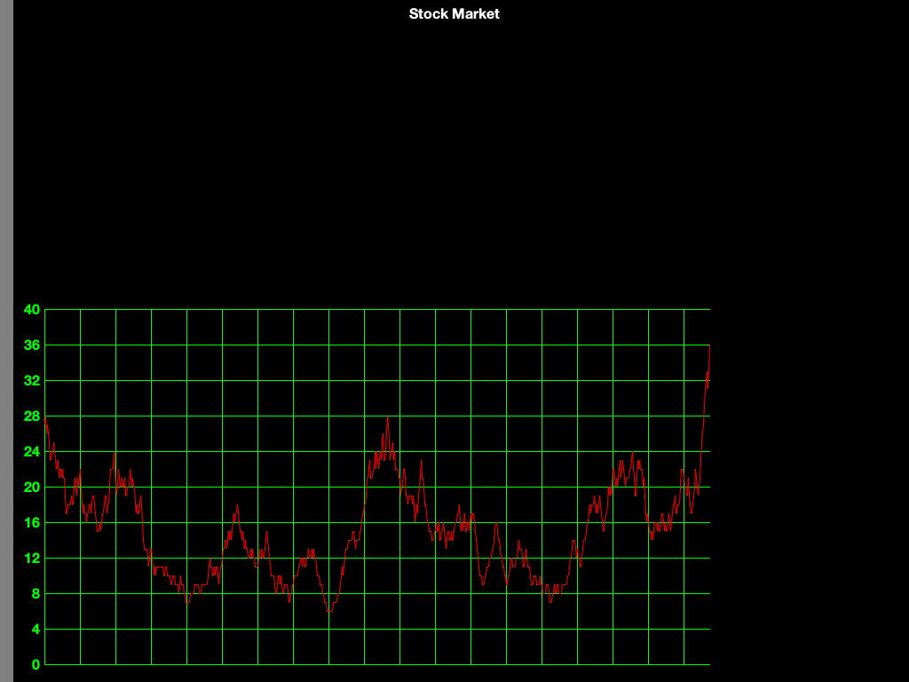
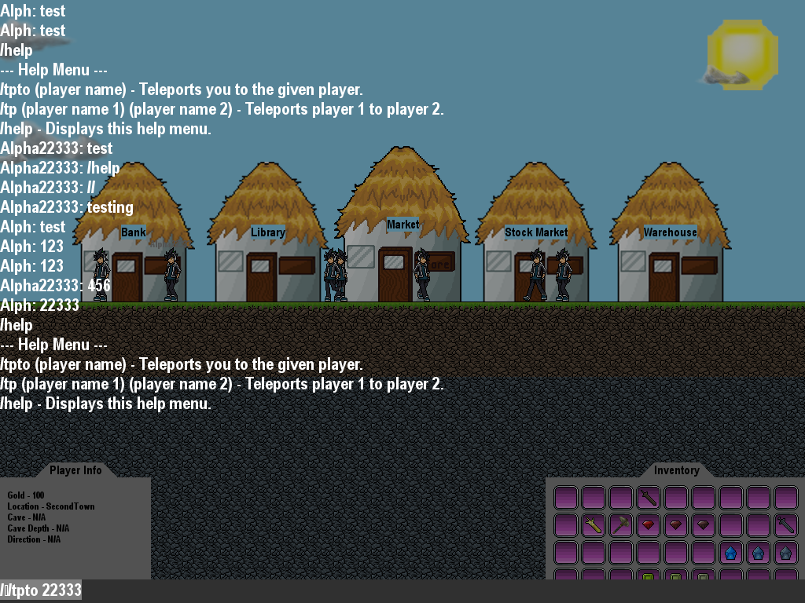
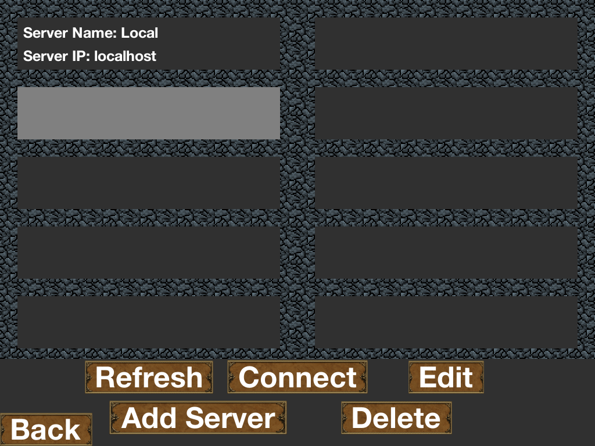
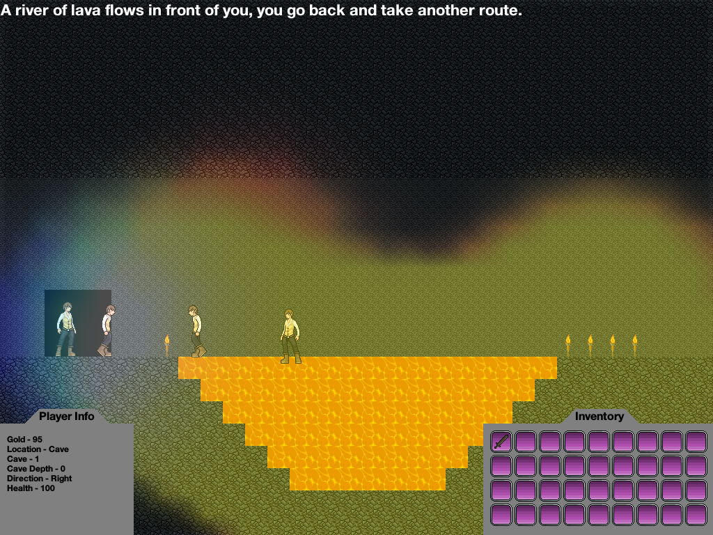

# CaveCrawler
Multiplayer RPG built in high school

Not my best example of clean code (please check the more recent repositories). But a nice application of multithreading, sockets, TCP/UDP, and other libraries.

TCP
-> Used for chat messages and sending map data
UDP
-> For entity positions

Numpy
-> For the lighting engine (to create a matrix of distances from a point)

The stock market uses a random walk plotted over time.

Multiplayer chat messaging.

UDP broadcast to 255.255.255.255 to find servers in local network.

Colour lighting by using numpy 3 times for the RGB channels.

